# SpringCloudAlibaba - 阿里分布式事务Seata

## 简介

**Seata：**简易可扩展的自治式分布式事务管理框架，其前身是fescar。是一种简单分布式事务的解决方案。  
Seata给用户提供了AT、TCC、SAGA和XA事务模式，AT模式是阿里云中推出的商业版本GTS全局事务服务，目前Seata的版本已经到了1.0，我们本篇用是0.9版本。官网：[https://github.com/seata/seata](https://github.com/seata/seata)

**Seata由3部分组成：**

1.事务协调器（TC）：维护全局事务和分支事务的状态，驱动全局提交或回滚，相当于LCN的协调者。

2.事务管理器（TM）：定义全局事务的范围：开始全局事务，提交或回滚全局事务，相当于LCN中发起方。

3.资源管理器（RM）：管理分支事务正在处理的资源，与TC进行对话以注册分支事务并报告分支事务的状态，并驱动分支事务的提交或回滚，相当于是LCN中的参与方。

**白话文分析Seata实现原理：**（与LCN基本一致，LCN前面博客有讲）

1. 发起方（TM）和我们的参与方（RM）项目启动之后和协调者TC保持长连接；  
2. 发起方（TM）调用接口之前向 TC 获取一个全局的事务的id 为xid，注册到Seata中．Aop实现    
3. 使用Feign客户端调用接口的时候，Seata重写了Feign客户端，在请求头中传递该xid。  
4. 参与方（RM）从请求头中获取到该xid，方法执行完后不会立马提交，而是等待发起方调完接口后将状态提交到协调者，由协调者再告知参与方状态。

## **Seata环境搭建**

下载对应Jar包并解压  ****


首先在订单库和派单库（三中的业务库）分别导入conf目录下的undo\_log.sql（专门做回滚用的），新建一个seata库，并把db\_store.sql导入到seata库，该库主要是存放seata服务端的一些信息。

接下来修改register.conf，type改为nacos，nacos里面localhost后面加上:8848，详细如下图：

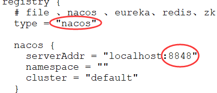

最后修改file.conf，store里面mode值改为db，并修改MySQL连接信息，注意库为上面建立的seata库：

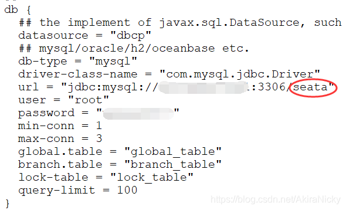

双击bin目录下的seata-server.bat，启动成功如下：（需先启动Nacos）


## 客户端整合SeataServer

分布式事务解决方案有很多，如RabbitMQ最终一致性，RocketMQ事务消息，开源框架LCN，以及阿里Seata等。

**业务场景：**与前面RocketMQ解决分布式事务场景一致：

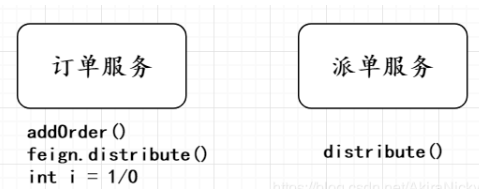

如图所示，相信我们都定过外卖，当提交订单后会在数据库生成一条订单，然后等待分配骑手送餐。

该业务在SpringCloud微服务架构拆分为两个服务，订单服务service-order和派单服务service-distribute，订单服务添加订单后，通过feign客户端调用派单服务的接口进行分配骑手，那么分布式事务问题就来了，当订单服务调用完第二行代码，派单接口执行完毕，咔嚓，第三行报了个错，那么订单接口会回滚，而派单则已提交事务，那么就造成数据不一致问题，故分布式事务问题，本文我们用Seata框架解决。

 **准备工作：**分别建立订单表（左：order\_table），派单表（右：distribute\_table）

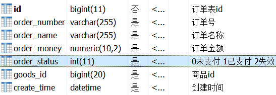

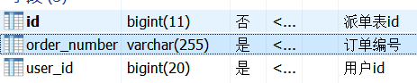

由于我们是SpringCloudAlibaba系列串讲，在前面博客建立好的service-impl添加如下依赖：

```text
<!-- mysql -->
<dependency>
    <groupId>mysql</groupId>
    <artifactId>mysql-connector-java</artifactId>
</dependency>
<!-- Seata -->
<dependency>
    <groupId>com.alibaba.cloud</groupId>
    <artifactId>spring-cloud-alibaba-seata</artifactId>
    <version>2.1.1.RELEASE</version>
</dependency>
<!-- Mybatis -->
<dependency>
    <groupId>org.mybatis.spring.boot</groupId>
    <artifactId>mybatis-spring-boot-starter</artifactId>
    <version>1.3.4</version>
</dependency>
```

application.yml或者bootstrap.yml 添加Seata配置，且将上面修改好的file.conf和registry.conf拷贝到resources目录下：

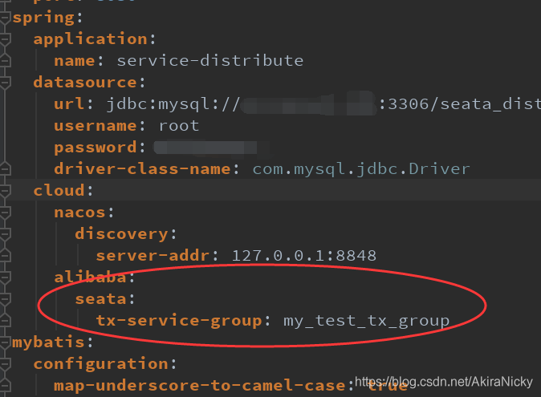

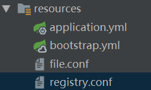

订单服务，派单服务启动类分别移除默认DataSource配置：

```text
@SpringBootApplication(exclude = DataSourceAutoConfiguration.class)
```

在订单服务和派单服务分别建立配置文件：

```text
package com.xyy.config;
 
import com.alibaba.druid.pool.DruidDataSource;
import io.seata.rm.datasource.DataSourceProxy;
import org.apache.ibatis.session.SqlSessionFactory;
import org.mybatis.spring.SqlSessionFactoryBean;
import org.mybatis.spring.transaction.SpringManagedTransactionFactory;
import org.springframework.boot.context.properties.ConfigurationProperties;
import org.springframework.context.annotation.Bean;
import org.springframework.context.annotation.Configuration;
import javax.sql.DataSource;
 
@Configuration
public class DataSourceProxyConfig {
    @Bean
    @ConfigurationProperties(prefix = "spring.datasource")
    public DataSource dataSource() {
        return new DruidDataSource();
    }
    @Bean
    public DataSourceProxy dataSourceProxy(DataSource dataSource) {
        return new DataSourceProxy(dataSource);
    }
    @Bean
    public SqlSessionFactory sqlSessionFactoryBean(DataSourceProxy dataSourceProxy) throws Exception {
        SqlSessionFactoryBean sqlSessionFactoryBean = new SqlSessionFactoryBean();
        sqlSessionFactoryBean.setDataSource(dataSourceProxy);
        sqlSessionFactoryBean.setTransactionFactory(new SpringManagedTransactionFactory());
        return sqlSessionFactoryBean.getObject();
    }
}
```

 接下来编写核心业务，**首先编写派单服务**

```text
public interface DistributeService {
    @RequestMapping("/distributeOrder")
    String distributeOrder(@RequestParam("orderNumber") String orderNumber);
}
```

```text
@RestController
public class DistributeServiceImpl implements DistributeService {
 
    @Autowired
    private DispatchMapper dispatchMapper;
 
    @Override
    public String distributeOrder(String orderNumber) {
        DispatchEntity dispatchEntity = new DispatchEntity(orderNumber,136L);
        dispatchMapper.insertDistribute(dispatchEntity);
        return "派单成功";
    }
}
```

```text
@Mapper
public interface DispatchMapper {
    // 新增派单任务
    @Insert("insert into distribute_table  values (null,#{orderNumber},#{userId})")
    @Options(useGeneratedKeys=true)
    int insertDistribute(DispatchEntity distributeEntity);
 
}
```

 **接下来编写订单服务：**

```text
@RestController
public class OrderService {
 
    @Autowired
    private OrderMapper orderMapper;
    @Autowired
    private DistributeServiceFeign distributeServiceFeign;
 
    @RequestMapping("/insertOrder")
    @GlobalTransactional
    public String insertOrder(int age) {
        String orderNumber = UUID.randomUUID().toString(); // 用uuid暂时代替雪花算法
        OrderEntity orderEntity = createOrder(orderNumber);
        // 1.向订单数据库表插入数据
        int result = orderMapper.insertOrder(orderEntity);
        if (result < 0) {
            return "插入订单失败";
        }
        // 2.调用派单服务，实现对该笔订单派单 远程调用派单接口
        String resultDistribute = distributeServiceFeign.distributeOrder(orderNumber);
        // 判断调用接口失败的代码...
        int i = 1 / age;
        return resultDistribute;
    }
 
    public OrderEntity createOrder(String orderNumber) {
        OrderEntity orderEntity = new OrderEntity();
        orderEntity.setOrderName("腾讯视频vip-年费");
        orderEntity.setCreateTime(new Date());
        orderEntity.setOrderMoney(new BigDecimal(300));
        orderEntity.setOrderStatus(0); // 未支付
        orderEntity.setGoodsId(101L); // 模拟商品id为101
        orderEntity.setOrderNumber(orderNumber);
        return orderEntity;
    }
}
```

```text
 
@FeignClient("service-distribute")
public interface DistributeServiceFeign extends DistributeService {
 
}
```

```text
@Mapper
public interface OrderMapper {
    @Insert("insert into order_table values (null,#{orderNumber}, #{orderName}, #{orderMoney}, #{orderStatus}, #{goodsId},#{createTime})")
    @Options(useGeneratedKeys=true)
    Integer insertOrder(OrderEntity orderEntity);
}
```

分别启动Nacos，Seata，service-order，service-distribute，正常访问订单接口，则订单，派单表分别新增一条数据：


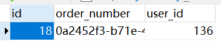

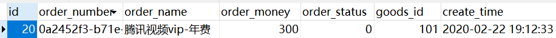

且两个控制台都会打印Commited日志：

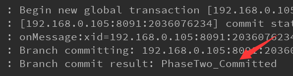

异常访问订单接口，则订单，派单表事务都会回滚，都不会新增数据，控制台都会打印Rollbacked：

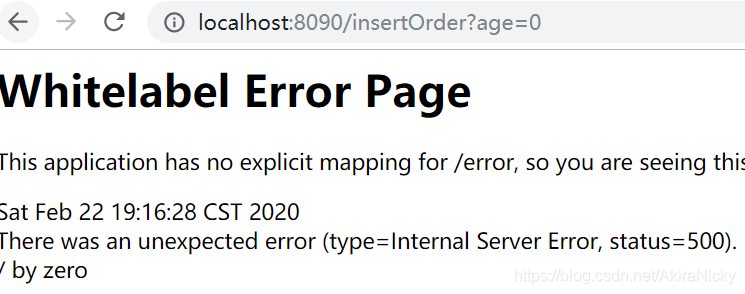

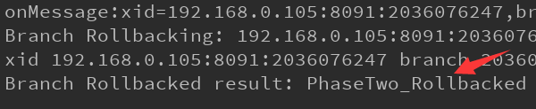

 **【总结】：**目前主流分布式事务解决方案有很多，如RabbitMQ最终一致性，RocketMQ事务消息，LCN假关闭，阿里Seata，可以根据业务合理选择解决方案，毕竟先把技术Get到，项目技术选型也会多一种选择 ~


\*\*\*\*

\*\*\*\*

\*\*\*\*

\*\*\*\*

\*\*\*\*

\*\*\*\*

\*\*\*\*

 ****

