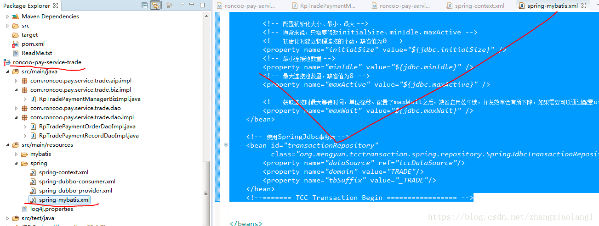

# TCC解决方案

一个主业务服务（交易订单）roncoo-pay-service-trade

两个从业务服务（资金账户roncoo-pay-service-account）（积分roncoo-pay-service-point）。

3个服务都要引入下面包

&lt;!-- tcc-transaction begin --&gt;  
&lt;dependency&gt;  
&lt;groupId&gt;org.mengyun&lt;/groupId&gt;  
&lt;artifactId&gt;tcc-transaction-spring&lt;/artifactId&gt;  
&lt;version&gt;${tcc.version}&lt;/version&gt;  
&lt;/dependency&gt;  
&lt;dependency&gt;  
&lt;groupId&gt;org.mengyun&lt;/groupId&gt;  
&lt;artifactId&gt;tcc-transaction-core&lt;/artifactId&gt;  
&lt;version&gt;${tcc.version}&lt;/version&gt;  
&lt;/dependency&gt;  
&lt;dependency&gt;  
&lt;groupId&gt;org.mengyun&lt;/groupId&gt;  
&lt;artifactId&gt;tcc-transaction-api&lt;/artifactId&gt;  
&lt;version&gt;${tcc.version}&lt;/version&gt;  
&lt;/dependency&gt;

1.引用tcc-transaction-spring包

从业务的api接口要引用（主服务的api接口不需要）

3个服务都要引用

3.数据库除了自己的业务数据库之外，还有一个tcc事务日志数据库。

&lt;!--======= 事务配置 Begin ================= --&gt;  
&lt;!-- 事务管理器（由Spring管理MyBatis的事务） --&gt;  
&lt;bean id="transactionManager"  
class="org.springframework.jdbc.datasource.DataSourceTransactionManager"&gt;  
&lt;!-- 关联数据源 --&gt;  
&lt;property name="dataSource" ref="dataSource"&gt;&lt;/property&gt;  
&lt;/bean&gt;  
&lt;!-- 注解事务 --&gt;  
&lt;tx:annotation-driven transaction-manager="transactionManager" /&gt;  
&lt;!--======= 事务配置 End =================== --&gt;

&lt;!--======= TCC Transaction Begin ================= --&gt;  
&lt;!-- 设置恢复策略\(可选），V1.1.0 新增定时任务配置 --&gt;  
&lt;bean class="org.mengyun.tcctransaction.spring.recover.DefaultRecoverConfig"&gt;  
&lt;!-- maxRetryCount表示一个事务最多尝试恢复次数，超过将不在自动恢复，需要人工干预，默认是30次 --&gt;  
&lt;property name="maxRetryCount" value="30"/&gt;  
&lt;!-- recoverDuration表示一个事务日志当超过一定时间间隔后没有更新就会被认为是发生了异常，需要恢复，  
恢复Job将扫描超过这个时间间隔依旧没有更新的事务日志，并对这些事务进行恢复，时间单位是秒，默认是120秒 --&gt;  
&lt;property name="recoverDuration" value="120"/&gt;  
&lt;!-- cronExpression表示恢复Job触发间隔配置，默认是\(每分钟\)0 \*/1 \* \* \* ? --&gt;  
&lt;property name="cronExpression" value="0 \*/1 \* \* \* ?"/&gt;  
&lt;/bean&gt;

&lt;!-- TCC 业务活动日志（事务日志）的数据源 --&gt;  
&lt;bean id="tccDataSource" class="com.alibaba.druid.pool.DruidDataSource"  
init-method="init" destroy-method="clone"&gt;  
&lt;!-- 基本属性driverClassName、 url、user、password --&gt;  
&lt;property name="driverClassName" value="${trade.jdbc.driver}" /&gt;  
&lt;property name="url" value="${trade.tcc.jdbc.url}" /&gt;  
&lt;property name="username" value="${trade.jdbc.username}" /&gt;  
&lt;property name="password" value="${trade.jdbc.password}" /&gt;

&lt;!-- 配置初始化大小、最小、最大 --&gt;  
&lt;!-- 通常来说，只需要修改initialSize、minIdle、maxActive --&gt;  
&lt;!-- 初始化时建立物理连接的个数，缺省值为0 --&gt;  
&lt;property name="initialSize" value="${jdbc.initialSize}" /&gt;  
&lt;!-- 最小连接池数量 --&gt;  
&lt;property name="minIdle" value="${jdbc.minIdle}" /&gt;  
&lt;!-- 最大连接池数量，缺省值为8 --&gt;  
&lt;property name="maxActive" value="${jdbc.maxActive}" /&gt;

&lt;!-- 获取连接时最大等待时间，单位毫秒。配置了maxWait之后，缺省启用公平锁，并发效率会有所下降，如果需要可以通过配置useUnfairLock属性为true使用非公平锁。 --&gt;  
&lt;property name="maxWait" value="${jdbc.maxWait}" /&gt;  
&lt;/bean&gt;

&lt;!-- 使用SpringJdbc事务库 --&gt;  
&lt;bean id="transactionRepository"  
class="org.mengyun.tcctransaction.spring.repository.SpringJdbcTransactionRepository"&gt;  
&lt;property name="dataSource" ref="tccDataSource"/&gt;  
&lt;property name="domain" value="TRADE"/&gt;  
&lt;property name="tbSuffix" value="\_TRADE"/&gt;  
&lt;/bean&gt;  
&lt;!--======= TCC Transaction Begin ================= --&gt;

同理其他两个从服务也一样这样配置。

4.进到主业务，在主业务的try里面会通过dubbo调用两个从业务的try方法。（每个业务里都有自己tcc3个方法）

completeSuccessOrder方法就是主业务的try方法。

confirmCompleteSuccessOrder方法就是主业务的confirm方法

cancelCompleteSuccessOrder方法就是主业务的cancel方法

主业务的try方法如下：

主业务的confirm方法如下：

主业务的cancel方法如下：

在主业务的try方法那里调用了从业务的try方法（例如调用资金业务的try方法，从业务里也有tcc3个方法的）如下：

资金业务的try方法：

资金业务的confirm方法：

资金业务的cancel方法：

同理从业务的积分也是一样有这tcc这3个方法。

总结：主业务--1从业务---2从业务，单有一个业务出现异常，3个业务都会回滚，对应的3个数据库的数据也会回滚

## 参考

[https://blog.csdn.net/zhangxiaolang1/article/details/79685733](https://blog.csdn.net/zhangxiaolang1/article/details/79685733)

